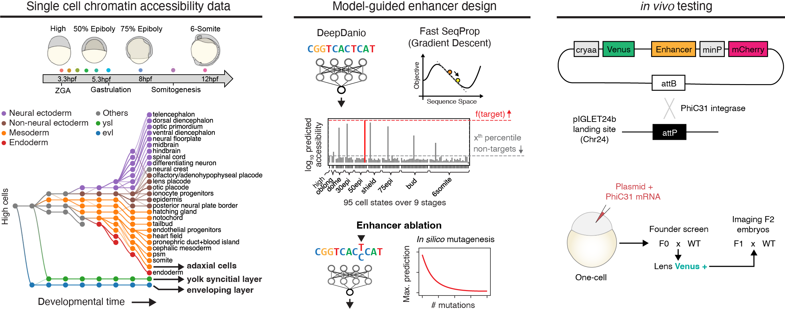

# *De novo* design of cell type-specific synthetic enhancers from chromatin accessibility in vertebrate embryos



This repository contains code associated with the article [Liu*, Castillo-Hair* et al. *De novo design of cell type-specific synthetic enhancers from chromatin accessibility in vertebrate embryos*](www.example.org). We design synthetic enhancers using **DeepDanio**, our [previously developed](https://doi.org/10.1101/2024.08.27.609971 ) AI predictor of chromatin accessibility trained on scATAC-seq data from zebrafish embryogenesis. A list of cell states predicted by DeepDanio for which enhancers can be designed can be found [here](./src/resources/cell_state_metadata.csv).

## Contents

- **`design/`** - Enhancer design scripts
  - `design.py` - Main sequence design pipeline
  
- **`models/`** - Pre-trained DeepDanio models
  - `download_model_weights.py` - Script to download model weights
  
- **`src/`** - Functions used during sequence design
  - `definitions.py` - Cell state definitions and constants
  - `sequence.py` - Sequence manipulation functions
  - `plot.py` - Plotting and visualization functions
  - `utils.py` - General utility functions
  - `resources/` - Data files.
    - `cell_state_metadata.csv` - Table with all cell states for which enhancers can be designed
    - `edge_prob.txt` - Needed to plot differentiation trajectories with predictions overlaid.

- **`pyproject.toml`** - Project configuration and dependencies

## Requirements

### Hardware requirements
Design scripts require NVIDIA GPUs to run. Enhancers in our publication were designed on `g5.xlarge` EC2 AWS instances, which have an NVIDIA A10G Tensor Core GPU with 24GB VRAM.

### Software requirements

#### OS requirements
This package has been tested on Amazon Linux 2, but most versions of Linux and macOS are expected to be compatible if package requirements are met (see below).

#### Python dependencies
Requirements are listed in `pyproject.toml`. Some important requirements are: Python 3.10 or 3.11, Tensorflow 2.14, Tensorflow probability 0.22.1, and our reimplementation of Fast SeqProp (https://github.com/castillohair/corefsp).

## Installation guide
We recommend using [uv](https://docs.astral.sh/uv/). To download the repository and install all requirements run the following:

```
git clone https://github.com/castillohair/enhancer-design-zebrafish
cd enhancer-design-zebrafish
uv sync
```

This should take care of installing the appropriate GPU-aware version of tensorflow when CUDA drivers are available.

Alternatively, after downloading, install requirements via:
```
pip install -e .
```

## Usage
First download the DeepDanio model weights:

```
cd models
python download_model_weights.py
cd ..
```

Then run `design/design.py` to design sequences. For a description of the command line arguments run

```
cd design
python design.py -h
```

The enhancer design tasks used in the paper can be recreated as follows:

```
# TODO: add specific commands
```